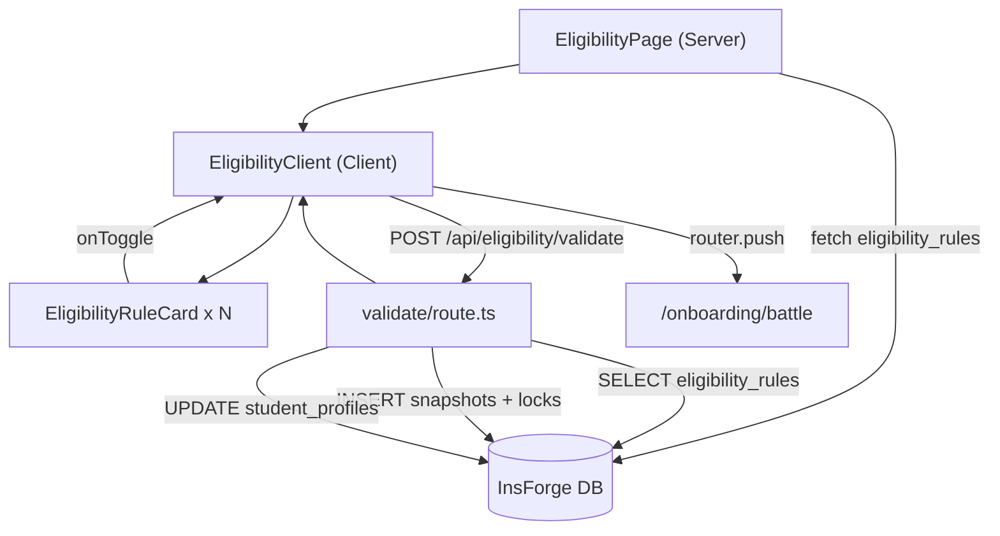

# Eligibility Guardian §8.4 — Full Build Plan

## Current State Assessment

The scaffold exists but nothing runs end-to-end yet:

- `[src/app/onboarding/eligibility/page.tsx](src/app/onboarding/eligibility/page.tsx)` — Server component that queries `eligibility_rules` (table does not exist yet → crashes)
- `[src/components/eligibility/EligibilityShell.tsx](src/components/eligibility/EligibilityShell.tsx)` — Header + stepper wrapper, done
- `[src/components/eligibility/EligibilityRuleCard.tsx](src/components/eligibility/EligibilityRuleCard.tsx)` — Subject rows, static display only, no checkbox logic
- `[src/components/eligibility/EligibilityStepper.tsx](src/components/eligibility/EligibilityStepper.tsx)` — Done
- Hard-lock CTA button: `disabled`, no API call wired

---

## Phase 0 — TASKS.md Bookkeeping

Mark `Setup` and `Build Fixes` as `[x] DONE` in `[TASKS.md](TASKS.md)`.

---

## Phase 1 — Database via InsForge CLI (6 tables + seed)

Run `insforge db query` for each SQL block in this order (FK chain):

### 1a. Reference tables

`**universities**`

```sql
CREATE TABLE universities (
  id UUID DEFAULT gen_random_uuid() PRIMARY KEY,
  name TEXT NOT NULL, short_code TEXT NOT NULL UNIQUE,
  city TEXT, state TEXT, is_active BOOLEAN DEFAULT true,
  created_at TIMESTAMPTZ DEFAULT now()
);
```

Seed: DU with deterministic id `00000001-0000-0000-0000-000000000001`

`**colleges**` → FK → `universities`

```sql
CREATE TABLE colleges (
  id UUID DEFAULT gen_random_uuid() PRIMARY KEY,
  university_id UUID REFERENCES universities(id) NOT NULL,
  name TEXT NOT NULL, short_code TEXT NOT NULL,
  campus_type TEXT, is_active BOOLEAN DEFAULT true,
  created_at TIMESTAMPTZ DEFAULT now()
);
```

Seed: SRCC, Miranda House, Hansraj (DU colleges)

`**programs**` → FK → `colleges`

```sql
CREATE TABLE programs (
  id UUID DEFAULT gen_random_uuid() PRIMARY KEY,
  college_id UUID REFERENCES colleges(id) NOT NULL,
  name TEXT NOT NULL, degree_type TEXT, discipline TEXT,
  seat_count INT, is_active BOOLEAN DEFAULT true,
  created_at TIMESTAMPTZ DEFAULT now()
);
```

Seed: B.Com (Hons) @ SRCC, B.A. Political Science (Hons) @ Miranda House

`**eligibility_rules**` → FK → `universities`, `colleges`, `programs`

```sql
CREATE TABLE eligibility_rules (
  id UUID DEFAULT gen_random_uuid() PRIMARY KEY,
  university_id UUID REFERENCES universities(id) NOT NULL,
  college_id UUID REFERENCES colleges(id),
  program_id UUID REFERENCES programs(id),
  exam_year INT NOT NULL, rule_version TEXT NOT NULL,
  stream_constraint TEXT,
  mandatory_subjects_json JSONB NOT NULL DEFAULT '[]',
  optional_subject_groups_json JSONB NOT NULL DEFAULT '[]',
  recommended_subjects_json JSONB NOT NULL DEFAULT '[]',
  min_domain_count INT, category_constraint TEXT,
  is_hard_lock BOOLEAN DEFAULT true, is_active BOOLEAN DEFAULT true,
  created_by UUID, created_at TIMESTAMPTZ DEFAULT now(), updated_at TIMESTAMPTZ DEFAULT now()
);
CREATE INDEX ON eligibility_rules (program_id, exam_year, is_active);
```

Seed: DU 2026 rules for both programs (English mandatory + domain groups)

### 1b. Lock tables

`**eligibility_lock_snapshots**` → FK → `student_profiles`, `eligibility_rules`

```sql
CREATE TABLE eligibility_lock_snapshots (
  id UUID DEFAULT gen_random_uuid() PRIMARY KEY,
  student_profile_id UUID NOT NULL,
  user_target_id UUID,
  eligibility_rule_id UUID REFERENCES eligibility_rules(id) NOT NULL,
  locked_subjects_json JSONB NOT NULL,
  validation_result_json JSONB NOT NULL,
  lock_hash TEXT NOT NULL,
  status TEXT NOT NULL DEFAULT 'locked',
  locked_at TIMESTAMPTZ DEFAULT now(),
  invalidated_at TIMESTAMPTZ,
  created_at TIMESTAMPTZ DEFAULT now()
);
```

`**student_subject_locks**` → FK → `eligibility_lock_snapshots`

```sql
CREATE TABLE student_subject_locks (
  id UUID DEFAULT gen_random_uuid() PRIMARY KEY,
  student_profile_id UUID NOT NULL,
  snapshot_id UUID REFERENCES eligibility_lock_snapshots(id) NOT NULL,
  subject_name TEXT NOT NULL, section TEXT NOT NULL,
  tag TEXT NOT NULL, locked_at TIMESTAMPTZ DEFAULT now()
);
```

RLS: Enable on all 6 tables. `universities`, `colleges`, `programs`, `eligibility_rules` → public SELECT. Lock tables → owner SELECT/INSERT via `auth.uid() = student_profile_id`.

---

## Phase 2 — API Route: `POST /api/eligibility/validate`

New file: `[src/app/api/eligibility/validate/route.ts](src/app/api/eligibility/validate/route.ts)`

Logic:

1. Auth check via `getUidFromCookies()`
2. Parse body: `{ rule_id, selected_subjects: string[] }`
3. Fetch rule from DB; validate mandatory subjects all present; validate optional group minimums met
4. If invalid → return `{ ok: false, mismatches: [...] }` (400)
5. If valid:
  - Generate `lock_hash = sha256(rule_id + uid + subjects.sort().join(',') + Date.now())`
  - INSERT `eligibility_lock_snapshots`
  - INSERT `student_subject_locks` (one row per subject)
  - UPDATE `student_profiles.account_state = 'eligibility_locked'`
  - Return `{ ok: true, lock_hash, snapshot_id }`

---

## Phase 3 — UI: Make `/onboarding/eligibility` Interactive

### 3a. Upgrade `EligibilityRuleCard`

Modify `[src/components/eligibility/EligibilityRuleCard.tsx](src/components/eligibility/EligibilityRuleCard.tsx)`:

- Accept `onToggle?: (subject: string, checked: boolean) => void` and `selected?: Set<string>` props
- Optional/Recommended rows render a checkbox; Mandatory rows remain locked with no checkbox
- Visual: checked state shows green checkmark badge instead of "Pending"

### 3b. New `EligibilityClient` wrapper

New file: `[src/components/eligibility/EligibilityClient.tsx](src/components/eligibility/EligibilityClient.tsx)`

`'use client'` — holds:

- `selectedSubjects: Set<string>` state (pre-seeded with mandatory subjects)
- `status: 'idle' | 'loading' | 'locked' | 'error'`
- `mismatches: string[]` for inline error display
- `handleLock()` — POSTs to `/api/eligibility/validate`
- Renders `EligibilityRuleCard` (with callbacks) + the Hard-lock CTA button
- CTA enabled only when all optional group minimums are satisfied (client-side guard)
- On success: shows a green lock-confirmation banner and calls `router.push('/onboarding/battle')`

### 3c. Update the Server Page

Modify `[src/app/onboarding/eligibility/page.tsx](src/app/onboarding/eligibility/page.tsx)`:

- Pass the fetched `rules` array + `ruleId` down into `<EligibilityClient rules={...} />`
- Remove the static hard-lock CTA block (now lives in `EligibilityClient`)

---

## Data Flow Diagram




---

## Files Touched Summary

- `TASKS.md` — mark milestones done
- `insforge db query` — 6× CREATE TABLE + seed INSERTs (no files changed, run via CLI)
- `src/app/api/eligibility/validate/route.ts` — **new**
- `src/components/eligibility/EligibilityClient.tsx` — **new**
- `src/components/eligibility/EligibilityRuleCard.tsx` — **modified** (add checkbox + callbacks)
- `src/app/onboarding/eligibility/page.tsx` — **modified** (pass to EligibilityClient)

